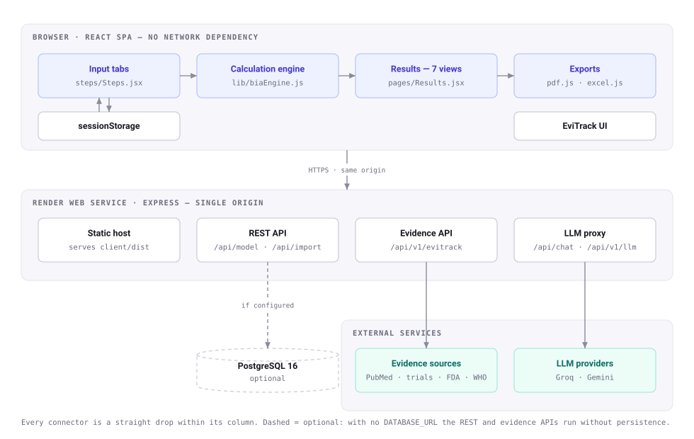
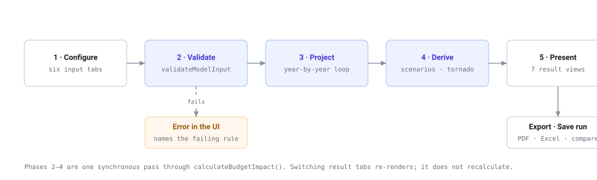
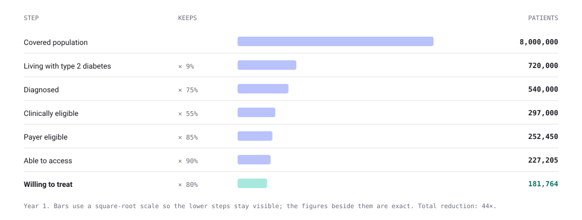
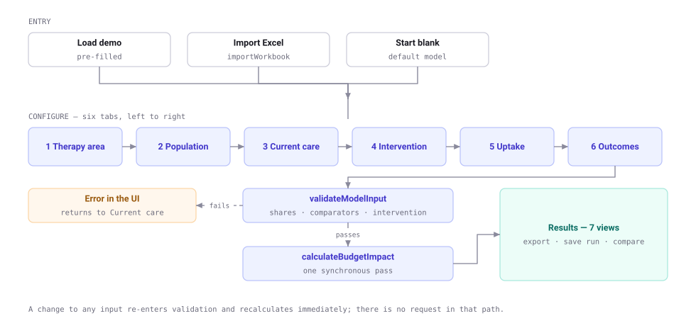
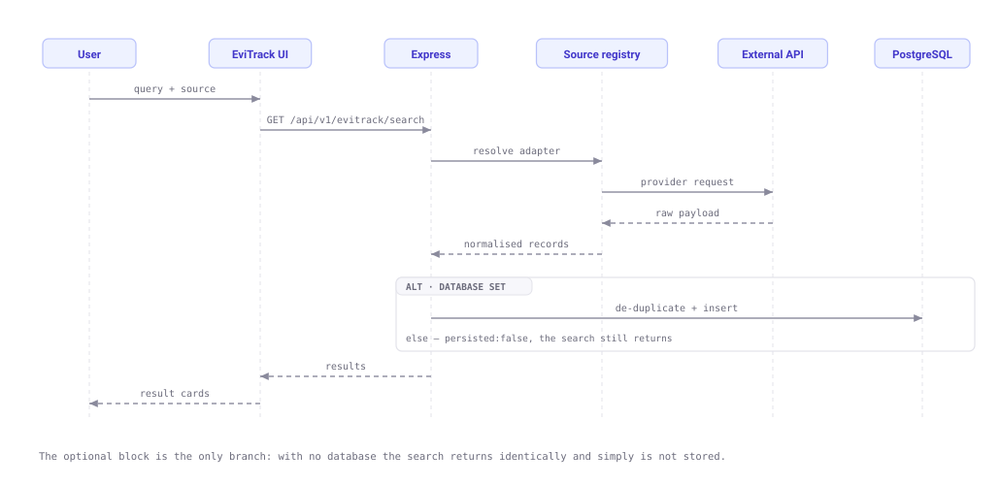
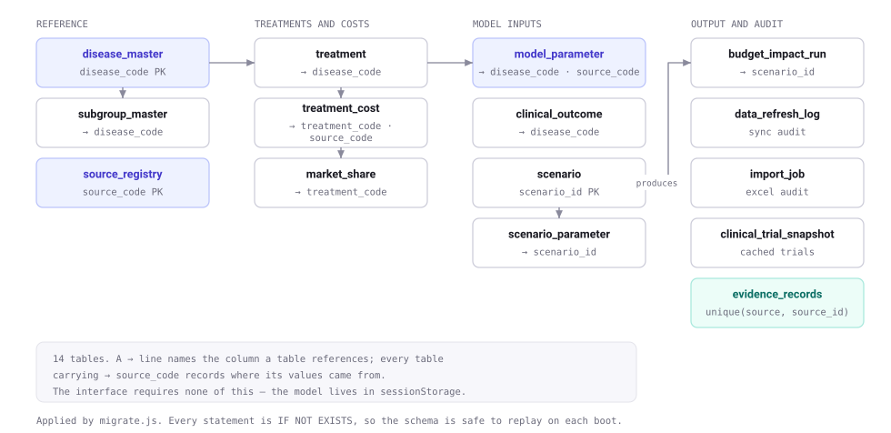

# BIET — Architecture and Test Documentation

Budget Impact Estimation Tool. Early-stage budget impact analysis (BIA) for
pharmaceutical decision support, with an evidence-retrieval companion module
(EviTrack).

This document covers the system architecture, the module and function
inventory, the calculation phases, the database structure, and the test cases
we run against it. It is written for a reviewer who has not seen the code.

- **Repository:** `Sumithraju/early_stage_bia_react_node_postgres`
- **Live:** https://early-stage-bia.onrender.com
- **Size:** 62 source files, ~9,000 lines across client and server
- **Stack:** React 18 + Vite, Node 20 + Express 4, PostgreSQL 16

---

## 1. What the system does

A budget impact analysis answers a payer's question: *if we reimburse this
drug, what happens to our budget over the next three to five years?* That is a
different question from cost-effectiveness, which asks whether the drug is good
value. BIA is about affordability and cash flow; CEA is about efficiency. The
tool deliberately does only the first.

The user configures a model across six tabs — therapy area, population, current
care, the new intervention, uptake, and clinical outcomes — and the tool
projects the budget difference between two worlds: current care continuing as
it is, and the new drug taking a share of the market.

### The central design decision

**The entire calculation runs in the browser.** There is no API call in the
path between changing an input and seeing a new number.

This was not the original design; the first version put the engine on the
server behind `POST /api/model/calculate`. We moved it client-side for three
reasons:

1. The app is deployed on Render's free tier, where an idle instance sleeps and
   takes roughly 50 seconds to wake. A demo that stalls on the first keystroke
   is a dead demo.
2. Recalculating on every input change is the whole point of a sensitivity
   tool. Round-tripping made that feel broken.
3. It removes the database from the critical path. Render's free PostgreSQL
   expires after 30 days, and we did not want the tool to die with it.

The server still exists, and it matters — but for things the browser genuinely
cannot do: calling third-party evidence APIs that block cross-origin requests,
holding an LLM key where the page source cannot leak it, and optional
persistence. The server-side engine at `server/src/services/biaEngine.js` is
retained so the REST API stays usable for scripted or programmatic runs.

---

## 2. System architecture



Everything inside the browser box runs with no network dependency at all. The
dashed edges to PostgreSQL are genuinely optional: with no `DATABASE_URL` the
server boots, logs that it is skipping migrations, and every endpoint that
needs storage returns a clear 503 rather than crashing.

### Why one service, not two

The client and API are served from a single Render web service on one origin.
Splitting them would mean configuring CORS and baking a cross-service hostname
into the Vite build at compile time — and Render cannot interpolate a service
URL into a build-time environment variable. One origin removes both problems.
`server/src/index.js` serves `client/dist` and falls through to `index.html`
for any non-`/api` path so client-side routing works on refresh.

---

## 3. Phases of a calculation

A single run moves through five phases. Phases 1 and 5 are the user's; 2 to 4
are one synchronous pass through `calculateBudgetImpact()`.



**Phase 1 — Configure.** Six tabs, each writing into one `model` object held in
React state and mirrored to `sessionStorage`. Switching disease reloads a whole
default model rather than patching individual fields, so comparators, outcomes
and subgroups always move together and cannot get into a mixed state.

**Phase 2 — Validate.** `validateModelInput()` enforces three invariants before
any arithmetic happens: at least one comparator exists, market shares sum to
1.0 within a 0.001 tolerance, and a new intervention is defined. These throw
rather than silently coercing, because a model whose shares sum to 0.9 produces
a plausible-looking but wrong answer, which is worse than an error.

**Phase 3 — Project.** `project()` walks the time horizon year by year. For
each year it applies the population funnel, computes the cost of the current
market and the cost of the market after the new drug takes its uptake share,
and takes the difference.

**Phase 4 — Derive.** Everything else is derived from the same projection:
three uptake scenarios (×0.5, ×1.0, ×1.5), a binary search for the break-even
price, a one-way tornado over ten parameters, and clinical events avoided.

**Phase 5 — Present.** Seven views over one result object. Nothing is
recalculated per tab — switching tabs is a render, not a run.

### The population funnel

This is the heart of the model, and it is where most of a reviewer's questions
land. Each step multiplies the one above it:



Prevalence and incidence are separate inputs on purpose. Prevalence is the
standing pool; incidence adds new cases each year. A prevalence-only model
understates a growing disease, and reviewers ask about it.

```js
const prevalence = clamp01(
  num(input.prevalence) * Math.pow(1 + num(input.annualPrevalenceGrowth), y - 1) +
    num(input.annualIncidence) * (y - 1)
);
```

Note the `clamp01`. Every rate in the engine is clamped to [0,1] and every
numeric read goes through `num()` with a fallback, so a malformed or hostile
input produces zero rather than `NaN` propagating through the whole result.

---

## 4. Module inventory

### Client — calculation and data (`client/src/lib/`)

| Module | Responsibility |
| --- | --- |
| `biaEngine.js` | The model. Funnel, costs, projection, break-even, validation. |
| `biaEngine.test.js` | 14 unit tests over the engine, run by vitest. |
| `sensitivity.js` | One-way tornado; re-runs the engine per parameter. |
| `diseases.js` | Disease registry (Obesity, T2D, MASH) with subgroups and defaults. |
| `excel.js` | Workbook import, template download, six-sheet results export. |
| `pdf.js` | Executive PDF report via jsPDF + autotable. |
| `runs.js` | Saved-run storage for the comparison tab. |
| `util.js` | Currency, percentage and count formatting; session persistence. |
| `assistant.js` | Local answer set and model context for the chat assistant. |
| `defaultModel.js` | Starting model when nothing is loaded. |

### Client — interface

| Module | Responsibility |
| --- | --- |
| `App.jsx` | Shell, tab state, BIA/EviTrack switch, import/export wiring. |
| `steps/Steps.jsx` | The six input tabs. |
| `pages/Results.jsx` | Seven result views plus the always-visible decision summary. |
| `components/Comparators.jsx` | Add/remove comparator columns; rescales shares to 100%. |
| `components/Funnel.jsx` | Population funnel visualisation. |
| `components/Assistant.jsx` | Chat assistant; server LLM first, local answers as fallback. |
| `components/Fields.jsx` | Typed inputs — currency, percentage, integer. |
| `components/Icons.jsx` | Inline SVG icon set. |

### Client — EviTrack (`client/src/features/evitrack/`)

| Module | Responsibility |
| --- | --- |
| `EviTrack.jsx` | Module shell, search orchestration, LLM status detection. |
| `SearchBox.jsx` | Query input and provider-aware model selection. |
| `SearchResults.jsx` | Result cards with per-result AI explanation. |
| `EvidenceWorkspace.jsx` | Curated evidence set, summarisation, Q&A. |
| `WHOChart.jsx` | WHO GHO indicator charts. |

### Server (`server/src/`)

| Module | Responsibility |
| --- | --- |
| `index.js` | Express app, static hosting, SPA fallback, CORS, health. |
| `db/pool.js` | Connection pool; exports `databaseConfigured`, null pool when unset. |
| `db/migrate.js` | Replays `schema.sql`, seeds once, non-fatal on failure. |
| `routes/chat.js` | LLM proxy with provider model discovery. |
| `routes/evitrack.js` | Evidence search, listing and storage. |
| `routes/llm.js` | Insight generation and evidence summarisation. |
| `routes/model.js` | Server-side calculation and run persistence. |
| `routes/import.js` | Server-side Excel ingestion. |
| `services/evitrack/sources/` | Five source adapters behind one registry. |
| `services/evitrack/llm/` | Groq and Gemini clients plus shared key resolution. |
| `services/parameterResolver.js` | Parameter precedence when reading from the DB. |

---

## 5. Function reference — the calculation engine

`client/src/lib/biaEngine.js` is the only place economic arithmetic lives.
Every other module reads from it. That was a deliberate constraint: an earlier
version had cost formulas duplicated across three components, and they drifted.

| Function | Signature | What it does |
| --- | --- | --- |
| `num` | `(value, fallback = 0) → number` | Safe numeric read. Non-numeric input yields the fallback, never `NaN`. |
| `clamp01` | `(value) → number` | Constrains a rate to [0,1]. |
| `annualTreatmentCost` | `(row) → number` | Drug + admin + monitoring + device, weighted by adherence and persistence. |
| `components` | `(row) → object` | The same cost split into named categories for the waterfall. |
| `retainedEffect` | `(weightRegainRate, year) → number` | Decays clinical benefit over time; benefit is not assumed permanent. |
| `effectiveRelativeRisk` | `(outcome, regain, year) → number` | Relative risk after decay, applied to responders only. |
| `medicalCostPerPatient` | `(outcomes, rrFor) → number` | Expected annual event cost per patient. |
| `validateModelInput` | `(input) → true \| throws` | The three pre-flight invariants. |
| `project` | `(input, { uptakeScale, drugCostOverride }) → object` | Year-by-year projection. Both options exist so scenarios and break-even reuse one code path. |
| `breakEvenDrugCost` | `(input, base) → number` | Binary search for the price at which net impact is zero. |
| `calculateBudgetImpact` | `(input) → object` | Public entry point. Returns summary, annual results, events, scenarios, comparison, per-patient. |

`tornado(model, delta = 0.2)` in `sensitivity.js` re-runs `calculateBudgetImpact`
once per parameter at ±20%, over ten parameters: price, uptake, prevalence,
incidence, diagnosis rate, clinical eligibility, adherence, responder rate,
adverse-event cost, and covered population. Results are sorted by swing.

---

## 6. User workflow



### EviTrack search sequence



---

## 7. Database structure

PostgreSQL 16, 14 tables. Applied by `server/src/db/migrate.js`, which replays
`sql/schema.sql` (every statement is `IF NOT EXISTS`, so it is safe to re-run
on every boot) and applies `sql/seed.sql` at most once, guarded by a
`schema_migrations` row and a data check.

**The interface does not require any of this.** The browser holds the working
model in `sessionStorage`. The schema exists for reference data, provenance
tracking, and run history — capabilities we want in a production version and
have built the storage for, but which the demo does not depend on.



### Table reference

| Table | Purpose |
| --- | --- |
| `disease_master` | Disease registry keyed by `disease_code`. |
| `subgroup_master` | Subgroups per disease, with dimension and sort order. |
| `source_registry` | Data sources, refresh cadence, last-success timestamps. |
| `model_parameter` | The central parameter store. Every value carries provenance, validity dates, bounds and an override flag. |
| `treatment` | Comparators and interventions per disease. |
| `treatment_cost` | Cost components per treatment per country, with adherence and persistence. |
| `market_share` | Share per treatment per scenario per year. |
| `clinical_outcome` | Event rates, relative risks, cost per event. |
| `scenario` / `scenario_parameter` | Named scenarios and their parameter overrides. |
| `budget_impact_run` | Persisted run results for history. |
| `data_refresh_log` | Public-data sync audit trail. |
| `import_job` | Excel ingestion audit trail. |
| `clinical_trial_snapshot` | Cached ClinicalTrials.gov records. |
| `evidence_records` | EviTrack evidence, unique on `(source, source_id)`. |

`model_parameter` is the widest table by design — 30 columns, most of them
provenance. A budget impact model is only as defensible as its inputs, so every
parameter records where it came from, when it was retrieved, what its bounds
are, and whether a user overrode it. `parameterResolver.js` implements the
precedence: user override, then scenario, then country-specific, then default.

---

## 8. Test cases

Three layers: 14 unit tests over the engine (vitest), browser tests driving the
real built bundle (Playwright), and endpoint checks against a running server.
The "Verified by" column says how each case is actually exercised — not every
case is automated, and the table says which.

### 8.1 Positive test cases

| ID | Test case | Input | Expected result | Verified by |
| --- | --- | --- | --- | --- |
| P-01 | Population funnel applies every factor in order | 8,000,000 covered · 9% prev · 75% dx · 55% clin · 85% payer · 90% access · 80% willing | 181,764 eligible in year 1 | vitest |
| P-02 | Net impact equals new-market minus current-market cost | Demo scenario | €296,601,076 over 5 years | vitest + Playwright |
| P-03 | Cost components reconcile exactly to scenario totals | Demo scenario | Category sum − scenario total = 0, not approximately | vitest |
| P-04 | Break-even price produces zero net impact | Demo scenario | Net impact ≈ 0 at €613/year | vitest |
| P-05 | Higher uptake produces larger impact | ×0.5 / ×1.0 / ×1.5 | €148.3M < €296.6M < €444.9M | vitest |
| P-06 | Incidence adds cases in later years only | 0.6% annual incidence | Year 1 unchanged; years 2–5 grow | vitest |
| P-07 | PMPM equals impact ÷ population ÷ 12 | Year 1 net €12,269,434 | €0.13 PMPM | vitest + Playwright |
| P-08 | Cumulative impact equals the sum of annual impacts | 5-year horizon | Cumulative = Σ annual | vitest |
| P-09 | Cost per treated patient reflects adherence | €3,200 list price | €2,527 per patient-year | vitest |
| P-10 | Events avoided counted when relative risk < 1 | 5 outcomes, RR 0.68–0.85 | 2,480 events, €17.96M avoided | vitest |
| P-11 | Tornado ranks parameters by swing | Price-dominated model | Drug price ranks first | vitest |
| P-12 | Market shares totalling 1.0 pass validation | 60% + 25% + 15% | No error | vitest |
| P-13 | Demo loads inputs and stays on step 1 | Click "Load demo" | Lands on Therapy area, all tabs pre-filled, does not jump to Results | Playwright |
| P-14 | PDF export produces a valid file | Results → Save as PDF | 41 KB, `%PDF-` header, demo footer present | Playwright |
| P-15 | Excel export produces a six-sheet workbook | Results → Export Excel | Valid `.xlsx` (PK header), 6 sheets | Playwright |
| P-16 | Currency formatting follows the model | EUR vs INR | 172,938 vs 1,72,938 grouping | Playwright |
| P-17 | EviTrack renders live results | Query "wegovy" | Result cards with source, year, DOI, actions | Playwright + manual |
| P-18 | BIA and EviTrack views coexist | Switch BIA ↔ EviTrack | Analysis preserved on return | Playwright |
| P-19 | Health endpoint reports subsystem state | `GET /api/health` | 200 with `database` and `llm` status | curl |
| P-20 | LLM proxy self-heals retired model names | All hardcoded models decommissioned | Discovers a live model and answers | Stubbed provider test |

### 8.2 Negative test cases

Negative cases matter more than positive ones here. A BIA that fails loudly is
recoverable; one that returns a confident wrong number is not.

| ID | Test case | Input | Expected result | Verified by |
| --- | --- | --- | --- | --- |
| N-01 | Market shares do not sum to 1.0 | 50% + 25% + 15% = 0.90 | Throws: "Current-care market shares must sum to 1.0. Current total: 0.900" | vitest + probe |
| N-02 | No comparator defined | `currentTreatments: []` | Throws: "At least one current-care comparator is required." | vitest + probe |
| N-03 | No intervention defined | `newIntervention: null` | Throws: "New intervention is required." | probe |
| N-04 | Negative prevalence | `prevalence: -0.5` | Clamped to 0; eligible patients = 0, no `NaN` | probe |
| N-05 | Zero covered population | `coveredPopulation: 0` | Net impact = 0, no division-by-zero | probe |
| N-06 | Unknown disease code | `defaultModelFor("NOPE")` | Falls back to OBESITY rather than throwing | probe |
| N-07 | Excel file with no recognised sheets | Arbitrary workbook | Throws: "No recognised sheets found. Download the template..." | code path |
| N-08 | Evidence search with empty query | `GET /search?q=` | 400 with "Query parameter 'q' is required." | curl |
| N-09 | Chat request without `messages[]` | `POST /api/chat` `{}` | 400 with "messages[] is required." | curl |
| N-10 | LLM requested with no key configured | `POST /api/v1/llm/generate` | 503 naming the variables to set — not a 500 | curl |
| N-11 | Unknown LLM provider configured | `LLM_PROVIDER=nonsense` | 400 with `Unknown LLM_PROVIDER "nonsense"` | code path |
| N-12 | Save evidence with no database | `POST /api/v1/evitrack/evidence` | 503: "Evidence storage is unavailable..." — search still works | curl |
| N-13 | Server starts with no `DATABASE_URL` | Unset the variable | Boots, logs skip, health reports "not configured", no crash | curl |
| N-14 | Upstream evidence API unreachable | PubMed blocked at network level | Clean JSON error, server stays up (200 on next request) | curl |
| N-15 | Upstream model decommissioned | Provider returns 400 "decommissioned" | Falls through to discovery; surfaces the provider's own message if all fail | Stubbed provider test |
| N-16 | Upstream auth failure | Invalid API key | Stops after one attempt, surfaces "Invalid API Key", does not retry every model | Stubbed provider test |

### 8.3 Running the tests

```bash
# Unit tests over the calculation engine
cd client && npx vitest run          # 14 tests

# Production build
npm run build

# Server smoke test with nothing configured
env -u DATABASE_URL -u LLM_API_KEY node server/src/index.js
curl localhost:4000/api/health
```

### 8.4 Coverage gaps, stated plainly

We would rather name these than imply coverage we do not have.

- The Playwright checks are written per change rather than kept as a committed
  suite. They run against the built bundle but are not wired into CI.
- No test covers the PostgreSQL-backed paths end to end. The DB-optional
  behaviour is tested; the DB-present behaviour is exercised manually.
- Live third-party calls (PubMed, Groq) are stubbed. The failure handling is
  tested against stubs; the happy path is confirmed by manual use.
- No load or concurrency testing. For a single-user analytical tool on a free
  instance, this has not been the constraint.

---

## 9. Deployment

Render Blueprint (`render.yaml`), one Node web service, auto-deploying from
`main`.

| Setting | Value |
| --- | --- |
| Build | `npm install --prefix server && npm install --prefix client && npm --prefix client run build` |
| Start | `node server/src/index.js` |
| Health check | `/api/health` |
| Node | 20 |

| Environment variable | Required | Purpose |
| --- | --- | --- |
| `DATABASE_URL` | No | PostgreSQL connection. Absent, the app runs without persistence. |
| `RUN_MIGRATIONS` | No | Applies schema and seed on boot. |
| `LLM_API_KEY` | No | Enables the assistant and EviTrack insights. |
| `LLM_PROVIDER` | No | `groq` (default), `openrouter`, `huggingface`, `xai`. |
| `GEMINI_API_KEY` | No | Adds Gemini to EviTrack's model picker. |
| `CLIENT_ORIGIN` | No | Only if the client is hosted separately. |

A provider-specific key takes precedence where present; otherwise `LLM_API_KEY`
is used when `LLM_PROVIDER` names that provider. One key configures both
features.

---

## 10. Known limitations

Stated so a reviewer does not have to find them.

- **Single-country.** The model runs one country at a time; multi-country
  aggregation is not implemented.
- **Subgroups share parent parameters.** Selecting a subgroup narrows the
  population but does not yet carry independent cost or outcome parameters.
- **Market share redistribution is proportional.** When the new drug takes
  share, it is drawn proportionally from comparators. Real displacement is
  rarely uniform.
- **One-way sensitivity only.** No probabilistic sensitivity analysis, no
  correlated parameter sampling.
- **Demonstration values are illustrative.** The built-in scenario is plausible
  but not drawn from a validated published source, and the tool says so in
  every exported PDF.
- **Free-tier constraints.** First load after idle takes roughly 50 seconds,
  and Render's free PostgreSQL expires after 30 days — which is why the
  application is built to run without it.
