# BIET demo guide

A tab-by-tab walkthrough of the built-in demonstration scenario: **Drug X, an
early-stage GLP-1, in Germany (Type 2 diabetes)**, from a statutory health
insurer's perspective over five years.

For each tab this guide gives the inputs to enter, what they mean, and the
numbers you should see. Every figure below was produced by the calculation
engine from exactly these inputs, so you can use it to check the tool is
behaving before you present.

> **All values are illustrative.** They are plausible for a demonstration but
> are not drawn from a validated published source. The app labels the scenario
> `● Demonstration data only` for exactly this reason. Do not present any
> number here as evidence about a real product.

## Starting the demo

Open the app and click **▶ Load demo** in the top bar. This fills every tab
with the scenario below and leaves you on **Therapy area** — it does not skip
to the answer. Walk the tabs left to right; each one adds a layer to the same
calculation.

| Want to | Do this |
| --- | --- |
| Reset to an empty model | **Reset** |
| Load inputs from a spreadsheet | **Import Excel** |
| Get a blank input workbook | **Template** |
| Search external evidence | **EviTrack** (top bar) |

---

## 1 · Therapy area

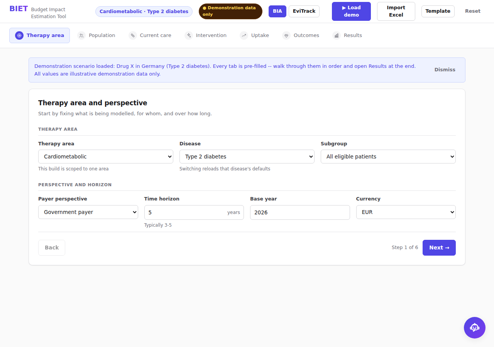

Sets the disease, the market and the accounting frame. Everything downstream
inherits these, so this is chosen first — changing the disease reloads a fresh
default model rather than patching individual fields.

| Field | Demo value | Why |
| --- | --- | --- |
| Therapy area | Cardiometabolic | Groups related diseases |
| Disease | Type 2 diabetes | Also available: Obesity, MASH |
| Subgroup | All eligible patients | Subgroups narrow the population |
| Country | Germany | Sets currency and formatting |
| Currency | EUR (€) | Applied across the app, exports included |
| Perspective | Statutory health insurer | Decides which costs count |
| Base year | 2026 | Year 1 of the projection |
| Time horizon | 5 years | Payer budget cycles are typically 3–5 |

**Say this:** a budget impact analysis answers "what does saying yes to this
drug do to my budget?" — not "is it good value?" That is a different question,
answered by cost-effectiveness analysis.

---

## 2 · Population

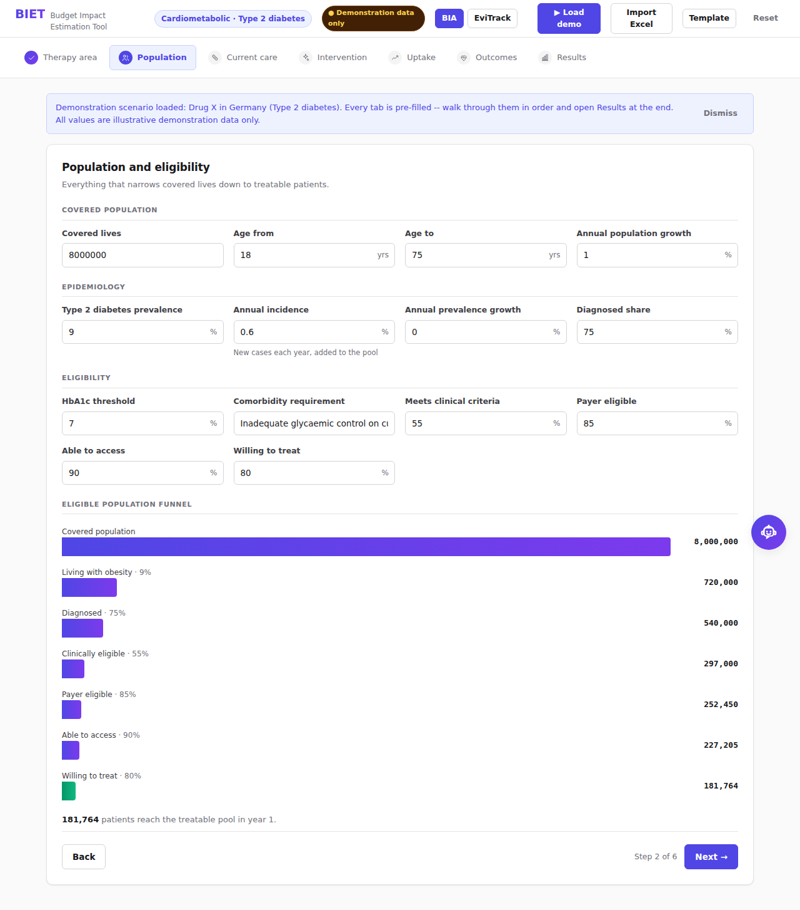

Narrows a whole covered population down to the patients who will actually be
treated. This is the funnel that drives every currency figure in the tool.

| Field | Demo value | Meaning |
| --- | --- | --- |
| Covered population | 8,000,000 | Lives the payer is responsible for |
| Annual population growth | 1% | Compounds each year |
| Age range | 18–75 | Label only in this model |
| Prevalence | 9% | Share of the population living with T2D |
| Annual prevalence growth | 0% | Change in prevalence itself |
| **Annual incidence** | **0.6%** | **New cases added each year** |
| Diagnosed | 75% | Prevalence ≠ diagnosed |
| Clinically eligible | 55% | Meets the label and clinical criteria |
| Payer eligible | 85% | Passes reimbursement rules |
| Able to access | 90% | Realistic supply and referral |
| Willing to treat | 80% | Patient and prescriber acceptance |

**Expected result:** the funnel ends at **181,764 eligible patients in year 1**.

Prevalence and incidence are separate on purpose: prevalence is the standing
pool, incidence adds new patients each year. A prevalence-only model
understates a growing disease, which is a common reviewer challenge.

---

## 3 · Current care

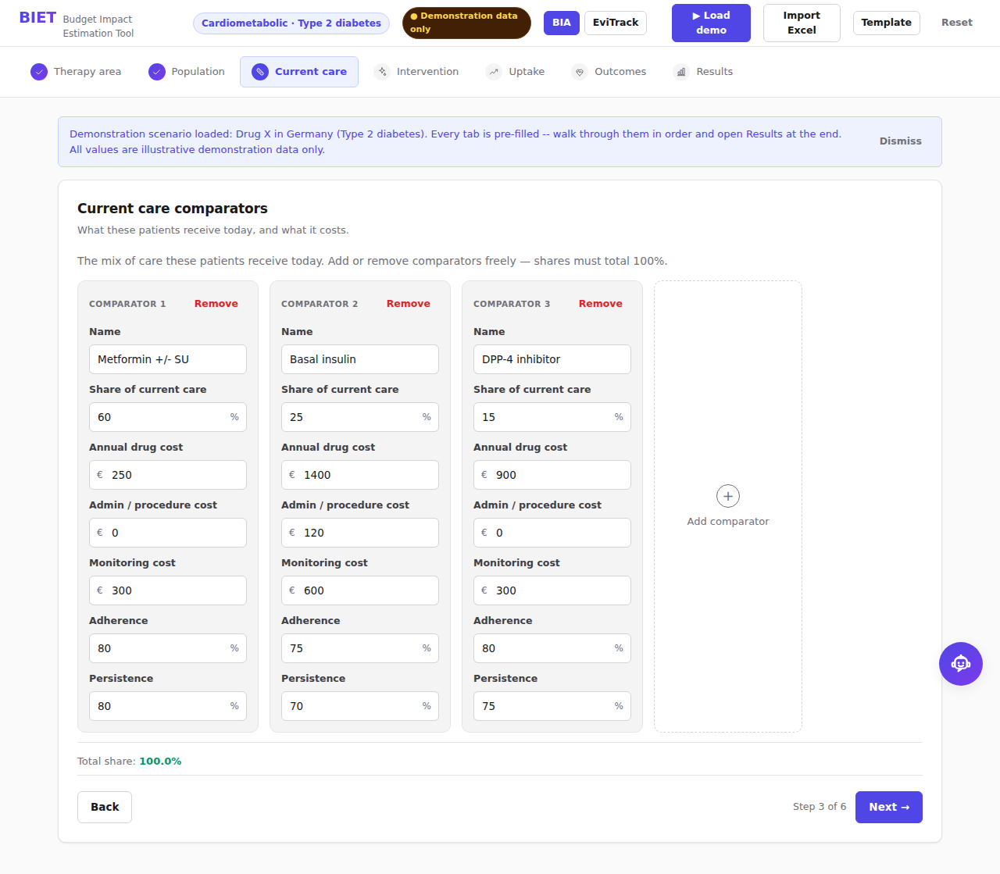

What the payer funds today — the comparison the new drug is measured against.
Add or remove a comparator with the **+** button; each one is a full column and
market shares rescale to 100%.

| Treatment | Share | Drug | Admin | Monitoring | Device | Adherence | Persistence |
| --- | --- | --- | --- | --- | --- | --- | --- |
| Metformin ± SU | 60% | €250 | — | €300 | — | 80% | 80% |
| Basal insulin | 25% | €1,400 | €120 | €600 | €250 | 75% | 70% |
| DPP-4 inhibitor | 15% | €900 | — | €300 | — | 80% | 75% |

Adherence and persistence matter: a patient who stops in month three does not
consume a full year of drug, and a model that ignores this overstates cost.

**Expected result:** current care totals **€1.73 billion** over five years.

---

## 4 · Intervention

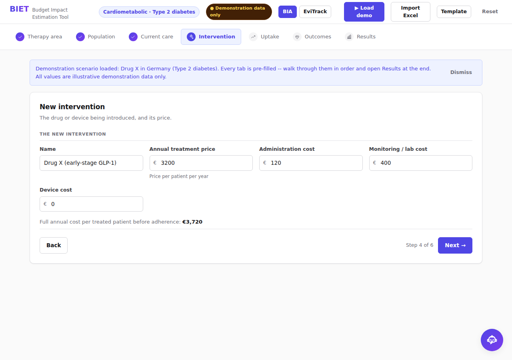

The new drug, on the same cost structure as the comparators so the comparison
is like-for-like.

| Field | Demo value |
| --- | --- |
| Name | Drug X (early-stage GLP-1) |
| Annual drug cost | €3,200 |
| Administration | €120 |
| Monitoring | €400 |
| Device | — |
| Adherence | 85% |
| Persistence | 78% |

**Say this:** the headline price is not the cost. €3,200 list becomes €2,527
per treated patient per year once adherence and persistence are applied — and
that gap is exactly what a payer argues about.

---

## 5 · Uptake

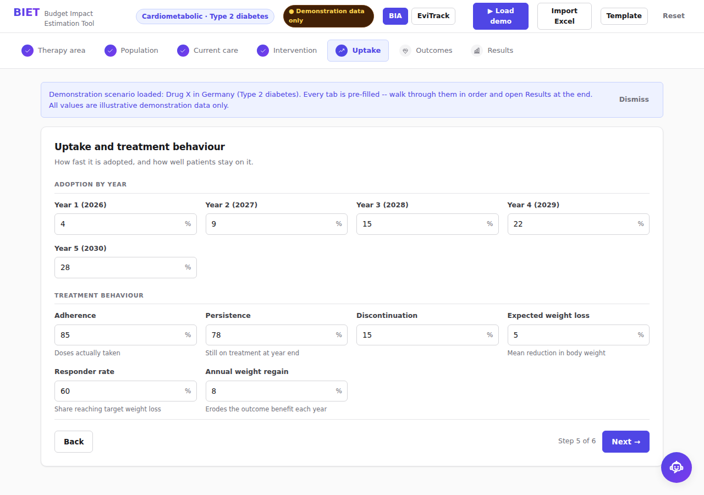

Share of eligible patients on the new drug each year. Budget impact is
dominated by this curve, so it gets its own tab.

| Year | 1 | 2 | 3 | 4 | 5 |
| --- | --- | --- | --- | --- | --- |
| Uptake | 4% | 9% | 15% | 22% | 28% |

A slow ramp is the realistic default for a new entrant. The Scenarios tab
re-runs the whole model at half and 1.5× these values.

**Expected result:** **67,083 patients treated at peak** (year 5).

---

## 6 · Outcomes

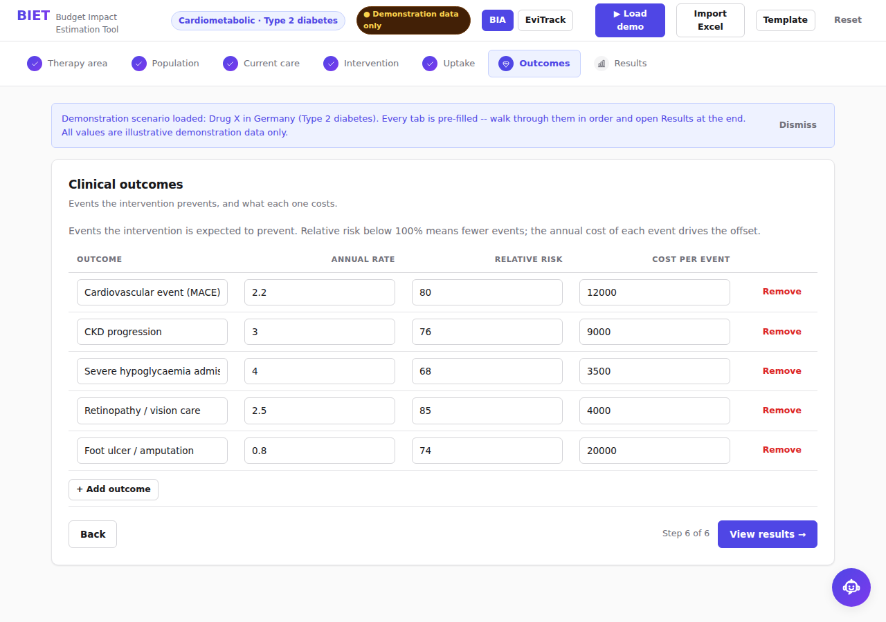

Clinical events the drug is expected to prevent, and what each costs. This is
where cost offsets come from — without it a BIA only ever shows a drug bill.

| Outcome | Current annual rate | Relative risk | Cost per event |
| --- | --- | --- | --- |
| Cardiovascular event (MACE) | 2.2% | 0.80 | €12,000 |
| CKD progression | 3.0% | 0.76 | €9,000 |
| Severe hypoglycaemia admission | 4.0% | 0.68 | €3,500 |
| Retinopathy / vision care | 2.5% | 0.85 | €4,000 |
| Foot ulcer / amputation | 0.8% | 0.74 | €20,000 |

A relative risk of 0.80 means a 20% reduction. Effects are applied only to
responders and are damped by the regain rate, so benefit is not assumed
permanent.

**Expected result:** **2,480 events avoided**, worth **€17.96M** in avoided
medical cost.

| Outcome | Events avoided | Cost avoided |
| --- | --- | --- |
| CKD progression | 591 | €5.32M |
| Cardiovascular event (MACE) | 361 | €4.33M |
| Severe hypoglycaemia | 1,050 | €3.68M |
| Foot ulcer / amputation | 171 | €3.41M |
| Retinopathy | 308 | €1.23M |

---

## 7 · Results

Seven views over one calculation. The decision summary sits above all of them
and never changes as you switch tabs.

### Budget impact

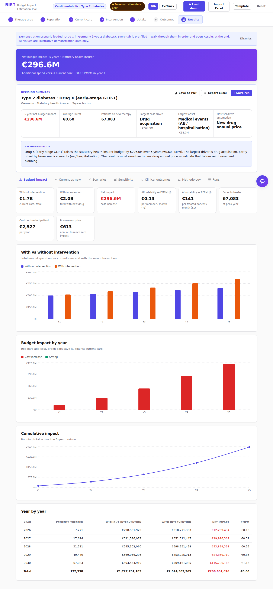

| Metric | Expected value | Reading |
| --- | --- | --- |
| **Net impact (5 yr)** | **€296.6M** | The headline |
| Without intervention | €1.73B | Current care |
| With intervention | €2.02B | After adoption |
| Affordability — PMPM | €0.13 | Per covered member per month, year 1 |
| Affordability — PPPM | €141 | Per *treated* patient per month |
| Patients treated | 67,083 | At peak |
| Cost per treated patient | €2,527 | Per year, after adherence |
| Break-even price | €613 | Annual price for zero net impact |

Year by year (base case):

| Year | 2026 | 2027 | 2028 | 2029 | 2030 |
| --- | --- | --- | --- | --- | --- |
| Net impact | €12.3M | €29.9M | €53.8M | €84.9M | €115.7M |

**Say this:** PMPM is the number a payer actually negotiates on. €296.6M sounds
alarming; **€0.13 per member per month** is the same fact in the unit that
decides the answer. Quote both.

### Current vs new

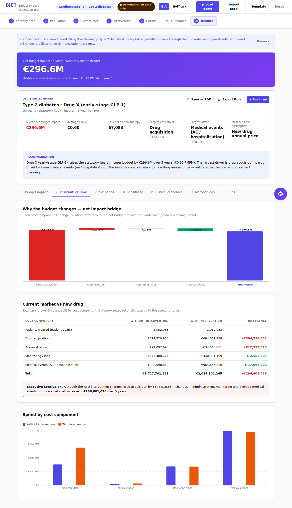

Splits both scenarios into cost components so you can see *where* the money
moves, not just that it moved.

- **Largest driver:** drug acquisition, **+€304.5M**
- **Largest offset:** medical events, **−€17.96M**

Component totals reconcile exactly to the scenario totals — the split is the
same arithmetic, not an approximation.

### Scenarios

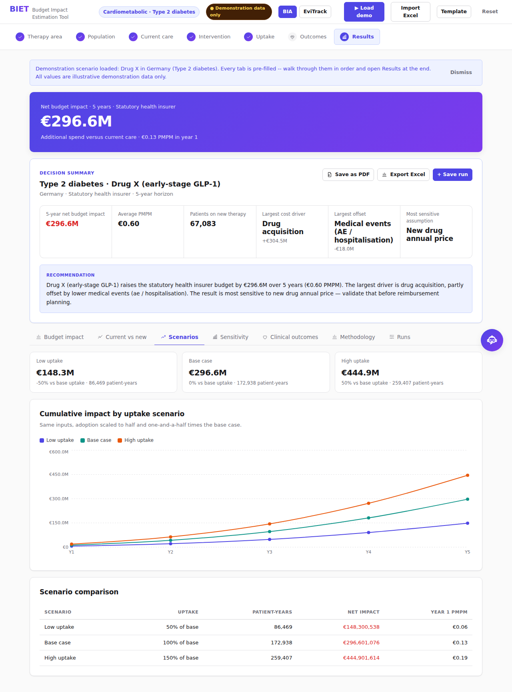

The whole model re-run at three uptake levels.

| Scenario | Uptake | Net impact (5 yr) | Year 1 PMPM |
| --- | --- | --- | --- |
| Low | ×0.5 | €148.3M | €0.06 |
| Base | ×1.0 | €296.6M | €0.13 |
| High | ×1.5 | €444.9M | €0.19 |

### Sensitivity

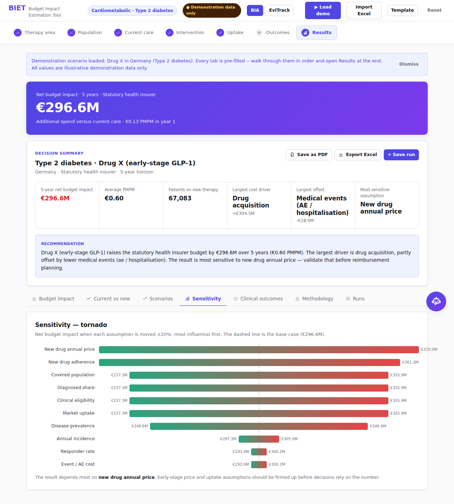

A one-way tornado: each parameter moved ±20% on its own, bars sorted by how
much the answer swings. Answers "what would change your mind?" — the top bar
is where to spend your evidence budget.

### Clinical outcomes

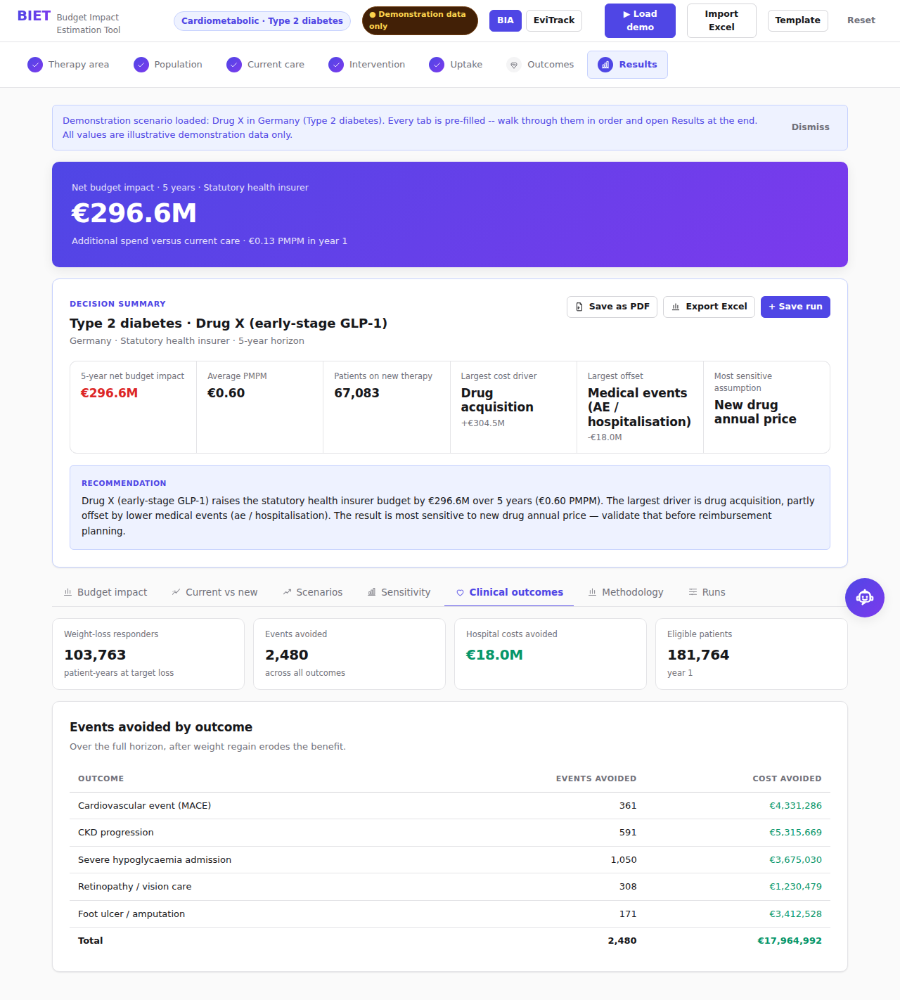

Events avoided and the cost that removes, by outcome. The counterpart to the
drug bill.

### Methodology

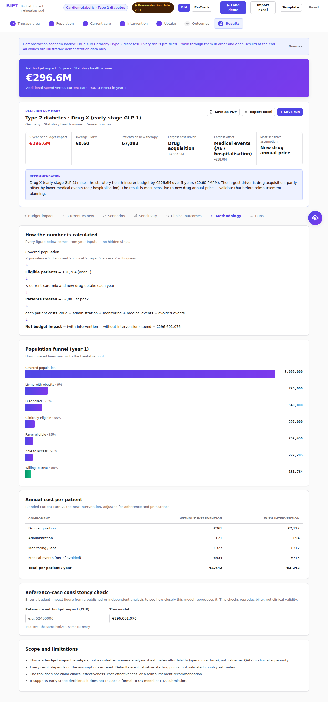

The full calculation chain, per-patient costs, and every assumption in force.
This is the auditability tab: a reviewer can follow a number from input to
headline without opening the code.

### Runs

Save a run, change an input, save again — the tab holds them side by side as
run 1 / run 2 / run 3 so you can show the effect of a single change.

---

## Exporting

Both buttons are in the Results toolbar and run entirely in the browser.

| Button | Produces |
| --- | --- |
| **Save as PDF** | Executive report: summary, year-by-year, components, scenarios, sensitivity, assumptions |
| **Export Excel** | Six sheets: Summary, Year by year, Current vs new, Scenarios, Sensitivity, Assumptions |

Currency in the PDF is written as an ISO code (`EUR 296,601,076`) because the
PDF font has no glyph for ₹.

---

## Assistant

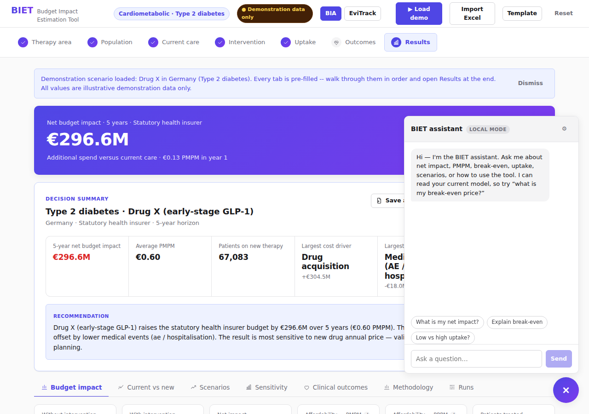

The robot button, bottom right. It answers questions about the current model
and its results. With no LLM key configured it still answers from a built-in
local set of BIA questions, so the demo never depends on a network call.

---

## EviTrack

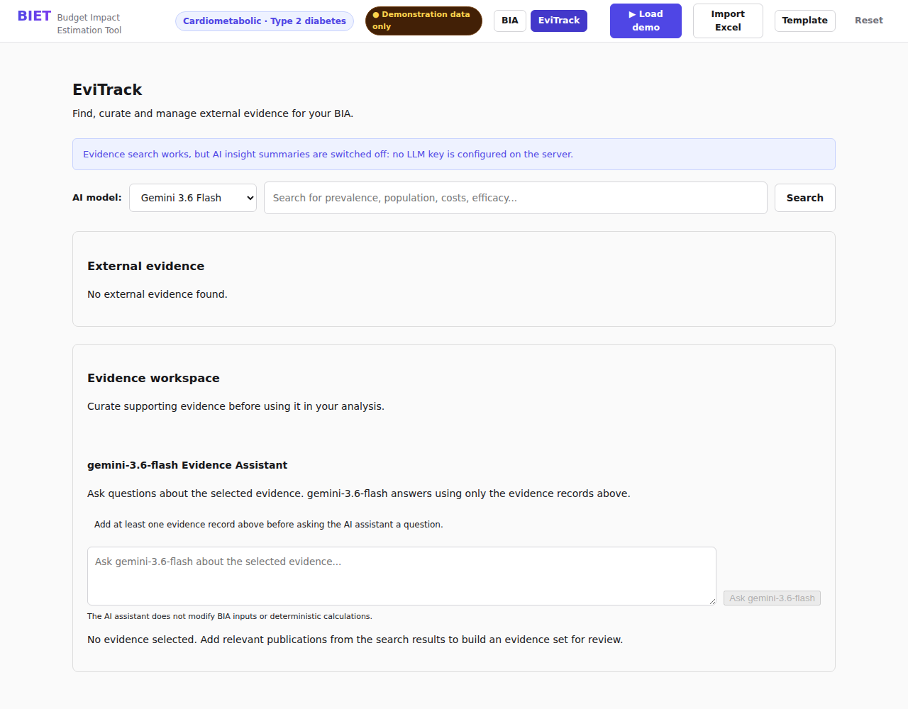

Reached from the **EviTrack** button in the top bar. Searches PubMed,
ClinicalTrials.gov, openFDA, WHO GHO and the World Bank, and collects what you
select into an evidence workspace. Where an LLM key is configured it will also
summarise each result — constrained to the retrieved text, and explicitly
barred from altering BIA inputs or calculations.

Search works with no database configured; records simply are not persisted
between sessions.

---

## Expected results at a glance

Load the demo, change nothing, open Results. If any of these differ, something
is wrong:

| Metric | Expected |
| --- | --- |
| Year 1 eligible patients | 181,764 |
| Current care total (5 yr) | €1,727,701,189 |
| With intervention (5 yr) | €2,024,302,265 |
| **Net budget impact (5 yr)** | **€296,601,076** |
| Year 1 PMPM | €0.13 |
| Average PMPM | €0.60 |
| Year 1 PPPM | €141 |
| Peak treated patients | 67,083 |
| Treated patient-years (5 yr) | 172,938 |
| Cost per treated patient | €2,527 |
| Break-even annual price | €613 |
| Events avoided (5 yr) | 2,480 |
| Medical cost offset (5 yr) | €17,964,992 |

## A 90-second version

1. **Load demo** — "Drug X, a GLP-1, in Germany. Five years, insurer's view."
2. **Population** — "8 million lives down to 181,764 eligible. Prevalence *and*
   incidence, because the pool grows."
3. **Uptake** — "4% to 28%. This curve drives the answer more than price does."
4. **Results** — "€296.6 million over five years. Which is **13 cents per
   member per month** — the number you actually negotiate on."
5. **Sensitivity** — "And here is what would change that answer."

## If something looks wrong

| Symptom | Cause |
| --- | --- |
| First load takes ~50 seconds | Free Render instance waking from sleep |
| Assistant says "AI unavailable" | No `LLM_API_KEY` set; local answers still work |
| EviTrack search returns nothing | Upstream API is rate-limited or unreachable |
| EviTrack does not keep records | No database configured — search still works |
| Numbers differ from the table above | An input was edited; press **Reset**, then **Load demo** |
